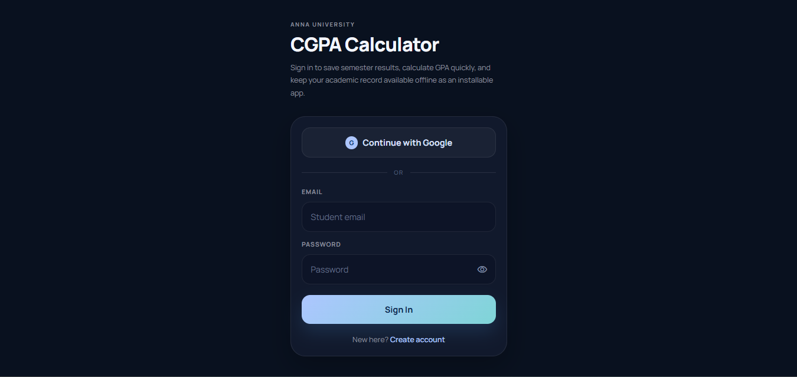
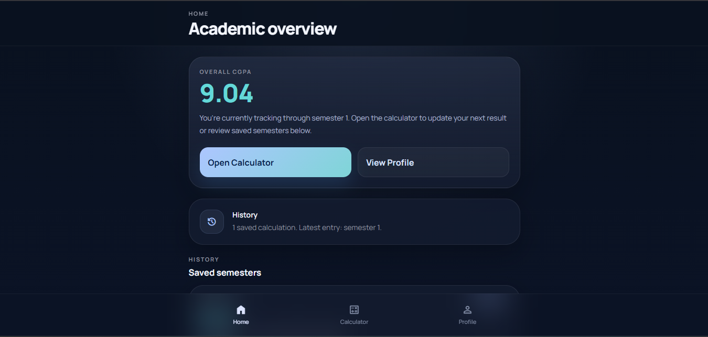
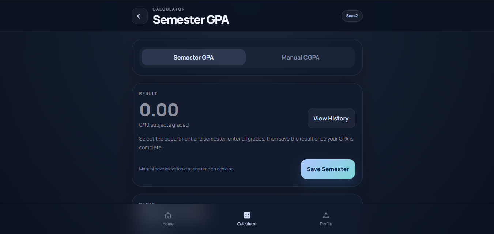
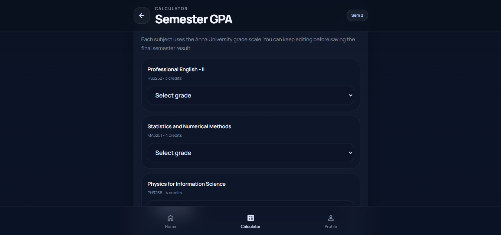
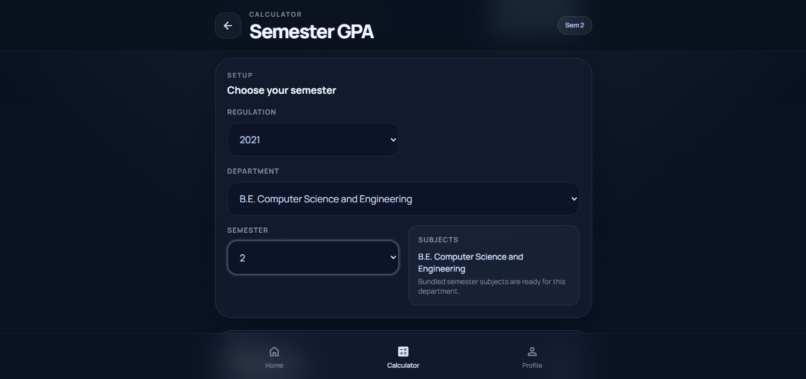
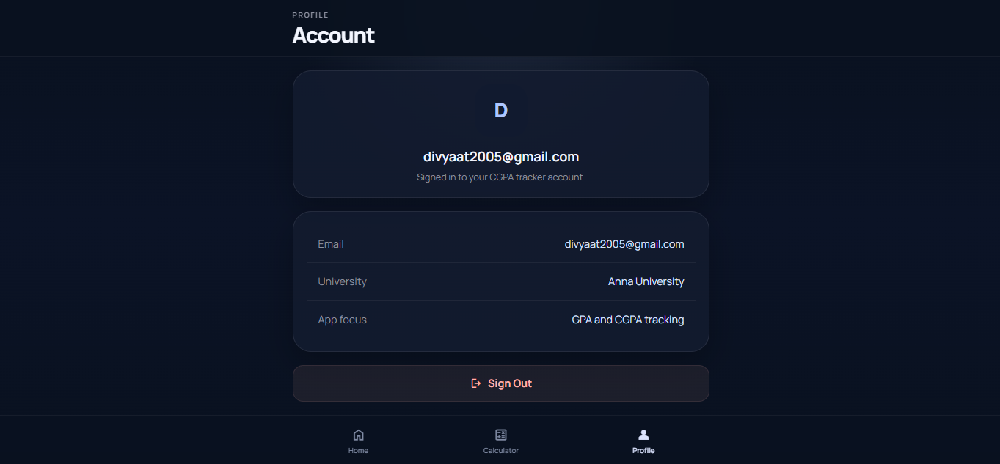

# AU CGPA Calculator

<div align="center">


**A modern Progressive Web App for calculating semester GPA and cumulative CGPA for Anna University students (Regulation 2021).**

[View Live App](https://cgpacalculator-five.vercel.app) · [Report Bug](https://github.com/Divya2k5/CGPA-calculator/issues) · [Request Feature](https://github.com/Divya2k5/CGPA-calculator/issues)

</div>

---

## 📸 Screenshots

<div align="center">

| Login | Academic Overview |
|:-----:|:-----------------:|
|  |  |

| Semester GPA Calculator | Grade Entry |
|:-----------------------:|:-----------:|
|  |  |

| Semester Setup | Profile |
|:--------------:|:-------:|
|  |  |

</div>

---

## Overview

AU CGPA Calculator is a full-stack web application designed to help Anna University students track their academic performance across all 8 semesters. It features real-time GPA computation, cloud-synced data, OCR-based grade scanning from marksheets, and works offline as an installable PWA.

---

## Features

- **Authentication** — Secure sign-in with Google or Email/Password via Firebase Auth
- **Academic Overview** — Dashboard showing overall CGPA and saved semester history
- **Live GPA Calculation** — Semester GPAs update in real time as grades are entered
- **CGPA Computation** — Aggregated CGPA across all completed semesters
- **Multi-Department Support** — Supports ECE, CSE, and other Anna University departments
- **OCR Grade Scanning** — Automatically extract grades from uploaded marksheet images
- **Cloud Sync** — All data persisted to Firestore, accessible across devices
- **Performance Analytics** — Visual charts and semester-wise breakdowns
- **Progressive Web App** — Installable on mobile and desktop, with full offline support
- **Regulation 2021 Compliant** — Pre-loaded with all subjects and credit values

---

## Tech Stack

| Layer | Technology |
|-------|------------|
| Framework | React 19 + Vite 6 |
| Styling | Tailwind CSS 3 |
| Routing | React Router DOM 7 |
| Authentication | Firebase Auth (Google + Email/Password) |
| Database | Cloud Firestore |
| Charts | Recharts |
| OCR | Tesseract.js |
| PWA | vite-plugin-pwa |
| Deployment | Vercel |

---

## Getting Started

### Prerequisites

- Node.js 18 or higher
- A Firebase project with **Email/Password** and **Google** sign-in enabled

### Installation

```bash
# 1. Clone the repository
git clone https://github.com/Divya2k5/CGPA-calculator.git
cd CGPA-calculator

# 2. Install dependencies
npm install

# 3. Configure environment variables
cp .env.example .env
# Open .env and fill in your Firebase project credentials

# 4. Start the development server
npm run dev
```

### Environment Variables

| Variable | Description |
|----------|-------------|
| `VITE_FIREBASE_API_KEY` | Firebase API key |
| `VITE_FIREBASE_AUTH_DOMAIN` | Firebase auth domain |
| `VITE_FIREBASE_PROJECT_ID` | Firebase project ID |
| `VITE_FIREBASE_STORAGE_BUCKET` | Firebase storage bucket |
| `VITE_FIREBASE_MESSAGING_SENDER_ID` | Firebase messaging sender ID |
| `VITE_FIREBASE_APP_ID` | Firebase app ID |
| `VITE_GEMINI_API_KEY` | Google Gemini API key (optional) |

---

## Build & Deployment

```bash
# Production build
npm run build

# Preview production build locally
npm run preview
```

The app is automatically deployed to **Vercel** on every push to the `main` branch.

---

## Grade Scale

| Grade | Points |
|-------|:------:|
| O | 10 |
| A+ | 9 |
| A | 8 |
| B+ | 7 |
| B | 6 |
| C | 5 |
| RA / U / Absent | 0 |

---

## Formulas

```
GPA  = Σ (Grade Point × Credit Hours) / Σ (Credit Hours)  [per semester]

CGPA = Σ (All Semester Grade Points × Credits) / Σ (All Credits)
```

---

## Contributing

Contributions are welcome. Please open an issue first to discuss what you would like to change.

1. Fork the repository
2. Create a feature branch (`git checkout -b feature/your-feature`)
3. Commit your changes (`git commit -m 'Add your feature'`)
4. Push to the branch (`git push origin feature/your-feature`)
5. Open a Pull Request

---

## Author

**Divya** — [@Divya2k5](https://github.com/Divya2k5)

---

## License

This project is free to use for educational purposes.